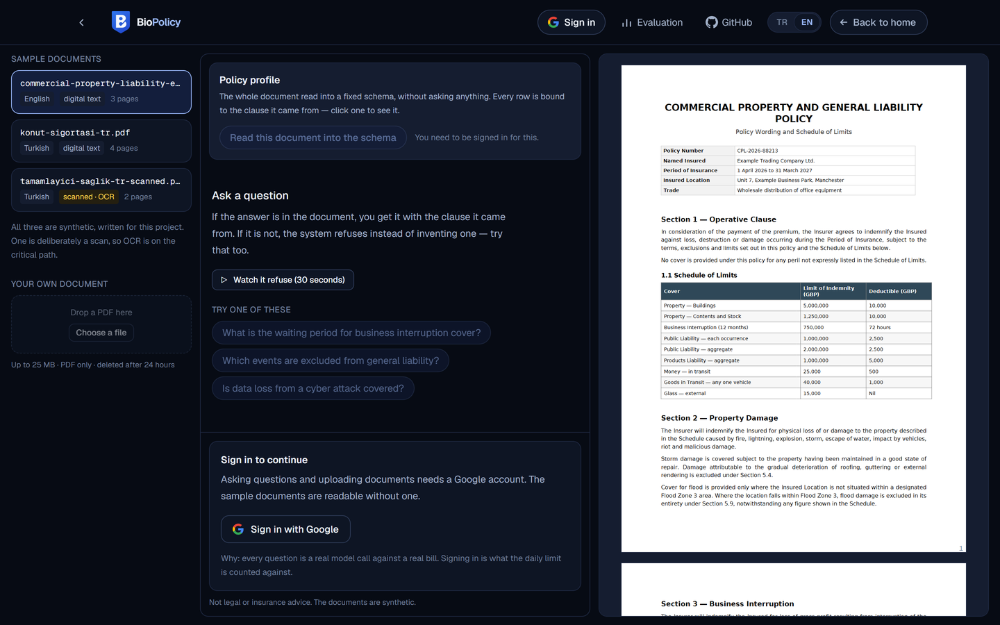
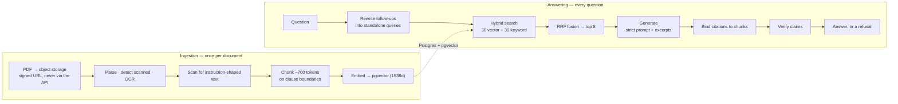
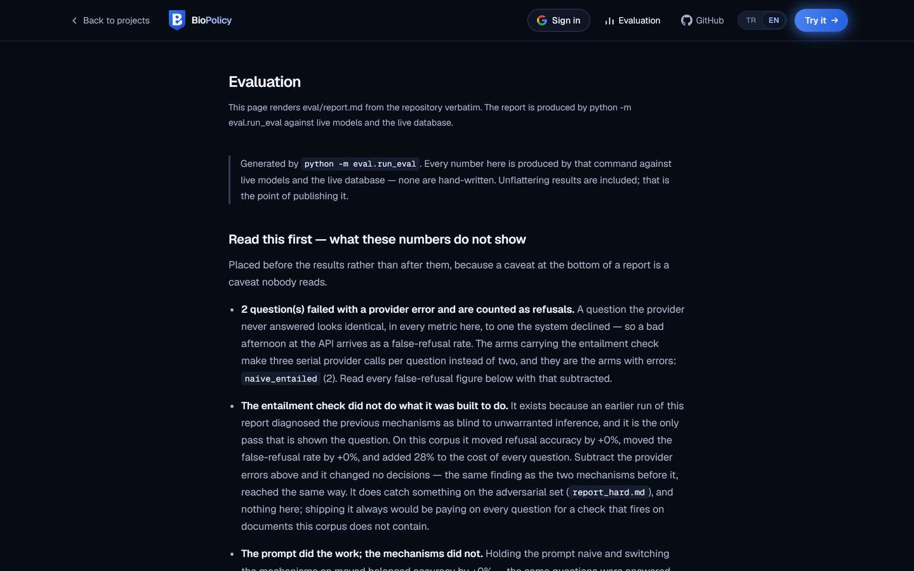

<div align="center">


# BioPolicy

**Ask your policy. Get the clause, not a guess.**

Multilingual, citation-grounded question answering over insurance policies and
legal contracts — built to be measured, not just demoed.

[](https://github.com/bilalgurkansanli/BioPolicy/actions/workflows/ci.yml)
[](./LICENSE)
[](./pyproject.toml)
[](./web/package.json)

**English** · [Türkçe](./README.tr.md)

[Live demo](https://biopolicy.bilalgurkansanli.com) ·
[Evaluation report](./eval/report.md) ·
[Architecture](./docs/ARCHITECTURE.md) ·
[Security](./docs/SECURITY.md) ·
[Decision records](./docs/adr)

</div>

---

> **Every number below was generated, not written.**
> [`eval/run_eval.py`](./eval/run_eval.py) produces them against live models and
> a live database, and the report it writes is published
> [verbatim](./eval/report.md) — including the run where the two mechanisms I
> built changed no decisions and added 45% to the cost of every question. A
> result that does not flatter the system is the only kind worth publishing.

<picture>
  
</picture>

## The problem

Ask a general-purpose chatbot whether your policy covers flood damage and it will
answer. It will answer fluently, in your language, with the confident cadence of
something that has read your document. Often it hasn't — it has read ten thousand
*other* policies, and it is telling you what policies usually say.

For a document you are about to rely on in a claim, "usually" is worse than
useless. It is wrong in a way that is expensive to discover.

## The thesis

> A retrieval system is only as trustworthy as its ability to say
> *"that isn't in this document."*

BioPolicy's differentiator is not that it answers questions. It is that it
**refuses correctly, cites precisely, and publishes the numbers proving both.**

Four mechanisms enforce that, each independently testable and each individually
switchable so the evaluation harness can measure what it actually contributes:

| # | Mechanism | What it prevents |
|---|---|---|
| 1 | Strict grounding prompt + structured output | The model answering from world knowledge instead of the document |
| 2 | Citation binding | Quotes that sound right but appear nowhere in the retrieved text |
| 3 | Self-verification & groundedness scoring | Answers whose individual claims aren't supported, even when the citations are real |
| 4 | Entailment check *(off by default)* | An answer whose every claim is supported and which still does not follow — a theft clause answering a question about a car |

Mechanism 4 exists because the evaluation said mechanisms 2 and 3 were not
earning their keep, and diagnosed exactly why. It was built to close that gap,
measured, and **switched off by its own numbers**: on the current prompt it
scores identically to the shipped configuration, to the decimal, for 28% more per
question — and it is a third serial provider call, which showed up as errors the
two-call arms did not have. ([ADR 014](./docs/adr/014-entailment-check.md)
records the original run, at 24%, under the previous prompt version.)

It stays in the codebase because on the adversarial corpus it caught a
contradiction the shipped configuration answered confidently and wrongly. One
environment variable turns it on. The whole experiment — including the part
where the metric was too coarse to represent the right answer — is
[ADR 014](./docs/adr/014-entailment-check.md).

If all citations on an answer fail verification, the answer is **not shown**. It
is downgraded to a refusal and counted. Those caught hallucinations appear in the
metrics below rather than in front of a user.

## Measured results

70 questions, 30% adversarial negatives. A 2×2 ablation: the **prompt** (strict
grounding versus naive) crossed with the **mechanisms** (citation binding and
self-verification). Full report: [`eval/report.md`](./eval/report.md).

| Arm | Refusal accuracy | False-refusal | Balanced | $/question |
|---|---:|---:|---:|---:|
| naive prompt, no mechanisms | 86% | 0% | 93% | $0.0035 |
| naive prompt **+ mechanisms** | 86% | 0% | 93% | $0.0062 |
| **strict prompt**, no mechanisms | 100% | 4% | 98% | $0.0049 |
| strict prompt + mechanisms *(shipped)* | 100% | 4% | 98% | $0.0072 |

**The prompt did the work. The mechanisms did not.**

Read the table by columns. Switching the *prompt* from naive to strict, with the
mechanisms off the whole time, moved balanced accuracy 93% → 98% and refusal
accuracy 86% → 100% — it fixed every missed refusal. Switching the *mechanisms*
on changed nothing in either direction: with the prompt held naive the numbers
are identical, and with it held strict they are identical again, to the decimal.
Binding dropped one citation across 70 questions and verification suppressed
none, while adding ~47% to the cost of every answer.

This README was drafted expecting the opposite table — the safety net rescuing a
mediocre baseline. It is published this way round because the alternative is the
exact failure the project argues against.

**Why the mechanisms missed:** the naive prompt's errors are *correct citations
supporting an unwarranted inference*. Asked whether a stolen car is covered, it
quotes the theft clause accurately and concludes the car is included. Binding
checks the quote is real — it is. Verification checks the claim against the
excerpt — the excerpt does say theft is covered. Neither is built to catch a
valid quote used to support a conclusion the document never draws.

**What still isn't proven.** Citation validity is 100% in every arm, but a
provider-enforced JSON schema makes invented chunk ids near-impossible by
construction — the interesting half of binding, a quote absent from the chunk it
names, has never been exercised. The report says so itself, in a section
computed from the run rather than written by hand.

**Every run is kept, so stability is checkable rather than claimed.** The shipped
configuration has now run three times with identical numbers. The entailment arm
did not: it swung from an 18% to a 4% false-refusal rate across three runs, and
most of that was provider overload errors, which are indistinguishable from
refusals in every metric here. Both facts are in
[`eval/results/history.jsonl`](./eval/results/history.jsonl) and charted on
`/eval` — a single number from a single run implies a stability nobody measured.

## When the document is the attacker

The mechanisms above assume the document is honest and the model might not be.
The reverse is also a real case: a policy prepared by a broker, an employer or a
landlord, with text inside it aimed at whatever AI reads it.

Six such attacks were written into one document and measured before anything was
built. The baseline result was not the expected one — the planted text mostly did
not hijack the answer, it **collapsed** it: 57% of answerable questions came back
as "cannot determine", with no mechanism involved. A hostile document made the
system useless rather than making it lie.

Two fixes, neither of which adds a model call:

| | |
|---|---|
| `answer_v2` | Excerpt text is evidence, never instruction — and explicitly neither permission to refuse nor permission to hide |
| Id removal | Text imitating an excerpt marker is stripped in code before the model sees it, because asking the model not to fall for it measurably did not work |

| Injection set | before | after |
|---|---:|---:|
| attacks obeyed | 1 of 6 | **0 of 6** |
| false-refusal | 57% | **14%** |

The 70-question demo set is **unchanged** at +9% per question in prompt tokens.

Uploaded documents are also scanned at ingest for instruction-shaped text and the
user is **told**, with the sentence quoted so they can find it in their own PDF.
That check is five regular expressions and no model call; it blocks nothing and
is not the defence. It fires on 5 of 5 rules for the injection document and on
none of the five honest ones. The whole experiment, including the fix that failed
and two metrics that had to be corrected after the fact, is
[ADR 015](./docs/adr/015-hostile-documents.md).

## How it works



Retrieval is scoped to **one document** — there is no shared corpus. Chunks are
re-retrieved on every turn and never carried forward: reusing the previous turn's
context is the cheap-looking optimisation that makes chat RAG confidently wrong.

**Stack.** Next.js (App Router) + TypeScript + Tailwind on Vercel ·
Python 3.12 + FastAPI in a container function · Supabase for Postgres, pgvector,
Auth and Storage · Claude Haiku for generation · Gemini for embeddings and vision
OCR.

Three platform constraints shaped the design more than any preference did:

1. **Serverless request bodies are small.** A 200-page policy exceeds the limit,
   so files never transit the API. The browser uploads straight to storage
   against a signed URL and the API only ever sees an object reference.
2. **Serverless functions are stateless and time-bounded.** Parsing, OCR and
   embedding a scanned document takes minutes, so ingestion is an asynchronous
   job with observable status transitions — never an inline request.
3. **pgvector's HNSW index tops out at 2000 dimensions.** The embedding model
   emits 3072 by default, so we explicitly request 1536 — the model is
   Matryoshka-trained, making truncation a designed-for operation rather than
   lossy mangling. See [`api/constants.py`](./api/constants.py).

Full walkthrough: [`docs/ARCHITECTURE.md`](./docs/ARCHITECTURE.md).

## Trade-offs I made deliberately

Recorded in full as [architecture decision records](./docs/adr). The short
version:

- **Lightweight PDF parsing over state-of-the-art.** Docling extracts tables
  better than what I ship here. It also pulls gigabytes of model weights, which
  on a scale-to-zero platform is paid for by every cold start. The parser sits
  behind an interface so it can be swapped.
- **No orchestration framework.** LlamaIndex is used for its node parsers and
  nothing else. Retrieval, prompting and generation are hand-written, because the
  part of this project worth learning is the part a framework would hide.
- **Hybrid retrieval, not pure vector.** Policy questions mix the semantic
  ("does this cover flooding?") with the exact ("Article 7.3", "TL 250.000").
  Vector search reliably misses the second kind.
- **Stage events, not token streaming.** A streaming answer feels faster, but
  citation binding and self-verification run *after* generation and can withhold
  the answer entirely. Text already on screen can only be retracted, and a
  retracted claim is still a delivered claim. The interface shows the real
  pipeline stages instead — see
  [ADR 010](./docs/adr/010-no-token-streaming.md).

## The interface

Three surfaces, all statically prerendered:

|  |  |
|---|---|
|  |  |
| The claim, and what the system does not do. | `eval/report.md`, rendered as written. |


- **`/`** — the claim, the numbers behind it, and what the system does not do.
- **`/app`** — the workspace. A document on the right, the conversation on the
  left, and citation chips that put a highlight on the exact clause they came
  from, on scanned pages as well as digital ones. Each answer carries its
  confidence, its groundedness score, whether the quote was verbatim or matched
  approximately, and what it cost.
- **`/eval`** — [`eval/report.md`](./eval/report.md) rendered verbatim, including
  the finding that the mechanisms changed no decisions, plus what the demo has
  spent so far and how the numbers have moved across runs.

You can also upload your own PDF. The file goes straight from the browser to
object storage against a signed URL — it never passes through the API — and
ingestion runs asynchronously with the real pipeline stages visible while it
works. Conversations are saved to your account, so you can come back to one.

Reading the samples needs no account. Asking a question does: **Google, and only
Google** ([ADR 013](./docs/adr/013-google-only-sign-in.md)). The allowance is
three questions and one document a day, which is small enough to be worth
evading — and an identity that costs nothing to create is not a limit, it is a
speed bump with a counter attached.

Turkish and English, switched from the header. The locale is a stored preference
rather than a URL segment, because the interface language and the *document's*
language are independent here — see
[ADR 011](./docs/adr/011-locale-is-a-preference.md).

## What this is not

BioPolicy summarises what a document says. It is **not legal or insurance
advice**, it does not tell you whether to file a claim or sign anything, and it
can be wrong. The citation is there so you can check it in one click.

Uploaded documents are irreversibly deleted — file and vectors — after 24 hours,
and you can delete one yourself at any time. That promise is enforced by a
scheduled job and [proven by automated tests](./api/tests/test_retention.py),
not by assertion.

The order those tests pin is the whole guarantee: the file leaves object storage
*first*, then the rows, then the audit entry. Deleting the rows first is the
natural thing to write, and it loses the storage path — the purge reports
success, the audit table agrees, and the PDF is still on disk with nothing left
pointing at it.

Spending is bounded in three layers: per-account daily quotas, a global budget
breaker that counts spend the moment it happens rather than when the ledger
catches up, and the provider console's own limit — the only one that still works
when this code is wrong.

The threat model, what a security review actually checked, and five accepted
risks stated plainly: [`docs/SECURITY.md`](./docs/SECURITY.md).

## Running it locally

Full instructions, including the Supabase and provider setup:
[`docs/RUNBOOK.md`](./docs/RUNBOOK.md).

```bash
uv sync --extra dev                          # Python 3.12 API
cp .env.example .env                         # then fill in the keys
uv run python -m api.scripts.migrate         # schema
uv run python -m eval.generate_samples       # synthetic sample PDFs
uv run python -m api.scripts.seed_samples    # ingest them
uv run uvicorn api.main:app --reload         # http://127.0.0.1:8000
```

```bash
cd web && npm install && npm run dev         # http://localhost:3000
```

The sample documents are **synthetic** — written for this project, not copied
from any insurer. That avoids the copyright and personal-data problems of
publishing a real policy, and it buys something better: because we wrote them, we
know exactly what they do and do not say, which is what makes an honest golden
dataset possible.

## Repository layout

| Path | What lives there |
|---|---|
| [`api/`](./api) | FastAPI service — ingestion, retrieval, generation, safety |
| [`api/generation/prompts/`](./api/generation/prompts) | Versioned prompt files. Changing one means a new version, not an edit |
| [`web/`](./web) | Next.js frontend, three surfaces, TR/EN |
| [`eval/`](./eval) | Golden datasets, the harness, and every published number |
| [`docs/adr/`](./docs/adr) | Why things are the way they are, including what failed |
| [`supabase/migrations/`](./supabase/migrations) | Schema, RLS, the retention job |

## Licence

MIT — see [LICENSE](./LICENSE). Every runtime dependency was checked for licence
compatibility; see [ADR 002](./docs/adr/002-pdf-parsing-stack.md) for why the
obvious PDF library isn't the one used here.
