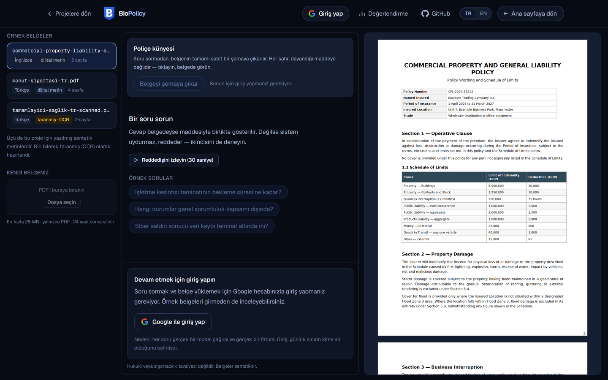
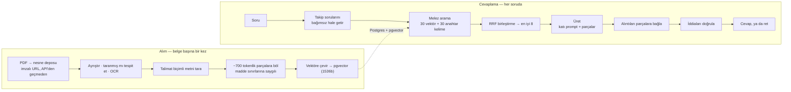
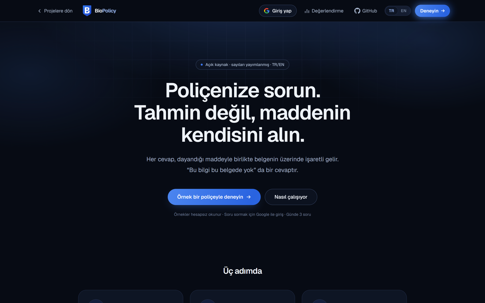
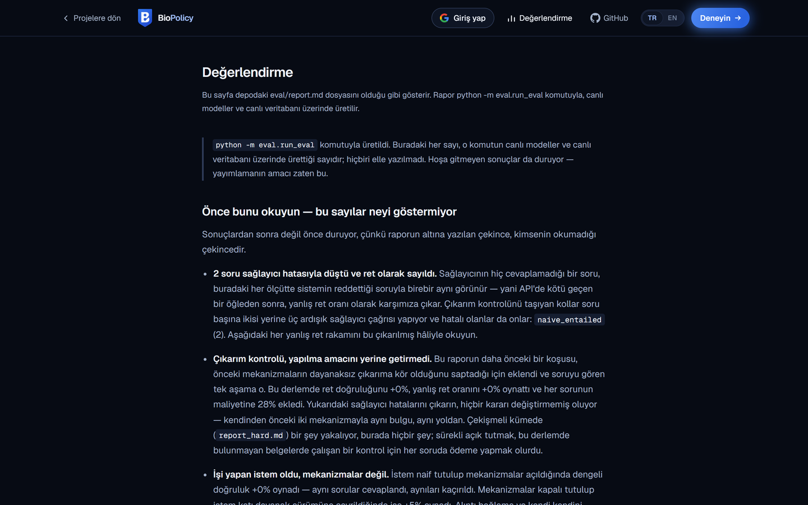

<div align="center">


# BioPolicy

**Poliçenize sorun. Tahmin değil, maddenin kendisini alın.**

Sigorta poliçeleri ve hukuki sözleşmeler üzerinde, kaynak gösteren, çok dilli
soru-cevap — gösterilmek için değil, ölçülmek için yazıldı.

[](https://github.com/bilalgurkansanli/BioPolicy/actions/workflows/ci.yml)
[](./LICENSE)
[](./pyproject.toml)
[](./web/package.json)

[English](./README.md) · **Türkçe**

[Canlı demo](https://biopolicy.bilalgurkansanli.com) ·
[Değerlendirme raporu](./eval/report.md) ·
[Mimari](./docs/ARCHITECTURE.md) ·
[Güvenlik](./docs/SECURITY.md) ·
[Karar kayıtları](./docs/adr)

</div>

---

> **Aşağıdaki her sayı üretildi, yazılmadı.**
> [`eval/run_eval.py`](./eval/run_eval.py) bunları canlı modellere ve canlı
> veritabanına karşı üretiyor; yazdığı rapor da
> [olduğu gibi](./eval/report.tr.md) yayımlanıyor — kendi yazdığım iki
> mekanizmanın hiçbir kararı değiştirmediği ve her sorunun maliyetine %45
> eklediği koşu dahil. Sistemi övmeyen bir sonuç, yayımlamaya değen tek sonuçtur.

<picture>
  
</picture>

## Problem

Genel amaçlı bir sohbet botuna poliçenizin sel hasarını karşılayıp
karşılamadığını sorun; cevap verecektir. Akıcı biçimde, sizin dilinizde, belgeyi
okumuş bir şeyin kendinden emin tonuyla cevap verecektir. Çoğu zaman okumamıştır
— on bin *başka* poliçe okumuştur ve size poliçelerin genelde ne dediğini
söylüyordur.

Hasar anında dayanacağınız bir belge için "genelde", işe yaramaz olmaktan da
kötüdür. Öğrenilmesi pahalıya patlayan bir yanlıştır.

## Tez

> Bir erişim sistemi, ancak *"bu, bu belgede yazmıyor"* diyebildiği kadar
> güvenilirdir.

BioPolicy'nin farkı soruları cevaplaması değil. Farkı, **doğru reddetmesi, kesin
kaynak göstermesi ve ikisini de kanıtlayan sayıları yayınlaması.**

Bunu dört mekanizma sağlıyor; her biri ayrı ayrı test edilebilir ve ayrı ayrı
kapatılabilir, ki değerlendirme düzeneği her birinin gerçekte ne kattığını
ölçebilsin:

| # | Mekanizma | Neyi önlüyor |
|---|---|---|
| 1 | Katı dayanak promptu + yapılandırılmış çıktı | Modelin belge yerine dünya bilgisinden cevap vermesi |
| 2 | Alıntı bağlama | Kulağa doğru gelen ama erişilen metinde hiç geçmeyen alıntılar |
| 3 | Öz-doğrulama ve dayanak puanı | Kaynaklar gerçek olsa bile tek tek iddiaları desteklenmeyen cevaplar |
| 4 | Gerektirme kontrolü *(varsayılan kapalı)* | Her iddiası desteklenen ama yine de sonucu çıkmayan cevap — araba sorusuna hırsızlık maddesiyle verilen cevap |

4. mekanizma, değerlendirme 2 ve 3'ün hakkını vermediğini söylediği ve bunun
nedenini tam olarak teşhis ettiği için yazıldı. O boşluğu kapatmak üzere
kuruldu, ölçüldü ve **kendi sayılarıyla kapatıldı**: güncel promptla yayındaki
yapılandırmayla virgülüne kadar aynı sonucu veriyor, soru başına %28 fazlaya —
üstelik üçüncü bir seri sağlayıcı çağrısı olduğu için iki çağrılı kollarda
olmayan hatalar üretti. ([ADR 014](./docs/adr/014-entailment-check.md) ilk
koşuyu, önceki prompt sürümü altında %24 olarak kaydediyor.)

Kod tabanında kalmasının sebebi, düşmanca korpusta yayındaki yapılandırmanın
kendinden emin ve yanlış cevapladığı bir çelişkiyi yakalamış olması. Tek bir
ortam değişkeni onu açıyor. Deneyin tamamı — metriğin doğru cevabı temsil
edemeyecek kadar kaba kaldığı kısım dahil —
[ADR 014](./docs/adr/014-entailment-check.md)'te.

Bir cevabın bütün alıntıları doğrulamadan geçemezse, cevap **gösterilmiyor.**
Ret'e düşürülüyor ve sayılıyor. Yakalanan bu uydurmalar kullanıcının önüne değil,
aşağıdaki metriklere çıkıyor.

## Ölçülmüş sonuçlar

70 soru, %30'u düşmanca negatif. 2×2 ablasyon: **prompt** (katı dayanak ile naif)
× **mekanizmalar** (alıntı bağlama ve öz-doğrulama). Raporun tamamı:
[`eval/report.md`](./eval/report.md).

| Kol | Doğru ret | Yanlış ret | Dengeli | $/soru |
|---|---:|---:|---:|---:|
| naif prompt, mekanizmasız | %86 | %0 | %93 | $0.0035 |
| naif prompt **+ mekanizmalar** | %86 | %0 | %93 | $0.0062 |
| **katı prompt**, mekanizmasız | %100 | %4 | %98 | $0.0049 |
| katı prompt + mekanizmalar *(yayındaki)* | %100 | %4 | %98 | $0.0072 |

**İşi prompt yaptı. Mekanizmalar yapmadı.**

Tabloyu sütunlardan okuyun. Mekanizmalar baştan sona kapalıyken *promptu* naiften
katıya çevirmek dengeli doğruluğu %93 → %98, doğru ret oranını %86 → %100
taşıdı — kaçırılan her reddi düzeltti. *Mekanizmaları* açmak ise hiçbir yönde
hiçbir şey değiştirmedi: prompt naif tutulduğunda sayılar aynı, katı tutulduğunda
yine aynı — virgülüne kadar. Bağlama 70 soruda tek bir alıntı düşürdü, doğrulama
hiçbir cevabı bastırmadı; buna karşılık her cevabın maliyetine ~%47 eklediler.

Bu dosya, tam tersi bir tablo beklenerek yazılmıştı: vasat bir tabanı kurtaran
emniyet ağı. Bu haliyle yayınlanıyor, çünkü alternatifi tam olarak bu projenin
karşı çıktığı hatanın kendisi olurdu.

**Mekanizmalar neden kaçırdı:** naif promptun hataları *yersiz bir çıkarımı
destekleyen doğru alıntılar*. Çalınan arabanın kapsanıp kapsanmadığı
sorulduğunda hırsızlık maddesini kusursuz alıntılıyor ve arabanın dahil olduğu
sonucuna varıyor. Bağlama alıntının gerçek olup olmadığına bakıyor — gerçek.
Doğrulama iddiayı metne karşı kontrol ediyor — metin gerçekten hırsızlığın
kapsandığını söylüyor. İkisi de, geçerli bir alıntının belgenin hiç varmadığı
bir sonucu desteklemek için kullanılmasını yakalayacak şekilde kurulmamış.

**Hâlâ kanıtlanmamış olan.** Alıntı geçerliliği her kolda %100, ama sağlayıcının
dayattığı JSON şeması uydurma parça kimliklerini yapısal olarak neredeyse
imkânsız kılıyor — bağlamanın asıl ilginç yarısı, yani adını verdiği parçada
bulunmayan bir alıntı, hiç sınanmadı. Raporun kendisi bunu söylüyor; hem de elle
yazılmış değil, koşudan hesaplanmış bir bölümde.

**Her koşu saklanıyor, böylece kararlılık iddia değil kontrol edilebilir bir şey.**
Yayındaki yapılandırma şu ana kadar üç kez koştu ve üçünde de aynı sayıları
verdi. Entailment kolu vermedi: üç koşuda yanlış ret oranı %18'den %4'e savruldu
ve bunun büyük kısmı sağlayıcı aşırı yük hatalarıydı — ki buradaki her metrikte
reddedişten ayırt edilemezler. İkisi de
[`eval/results/history.jsonl`](./eval/results/history.jsonl) dosyasında ve `/eval`
sayfasında grafikli. Tek bir koşudan gelen tek bir sayı, kimsenin ölçmediği bir
kararlılığı ima eder.

## Saldırgan belgenin kendisi olduğunda

Yukarıdaki mekanizmalar belgenin dürüst, modelin şüpheli olduğunu varsayıyor.
Tersi de gerçek bir durum: bir acentenin, işverenin ya da ev sahibinin
hazırladığı, içinde kendisini okuyacak yapay zekâya yönelik metin bulunan bir
poliçe.

Böyle altı saldırı tek bir belgeye yazıldı ve **hiçbir şey inşa edilmeden önce**
ölçüldü. Taban sonuç beklenen değildi — yerleştirilen metin cevabı çoğunlukla
kaçırmadı, **çökertti**: cevaplanabilir soruların %57'si "belirlenemedi" olarak
döndü ve hiçbir mekanizma devreye girmedi. Düşmanca bir belge sistemi yalancı
değil, işe yaramaz hale getirdi.

İki düzeltme, ikisi de model çağrısı eklemiyor:

| | |
|---|---|
| `answer_v2` | Alıntı metni kanıttır, asla talimat değildir — ve açıkça ne reddetme ne de gizleme izni |
| Kimlik silme | Alıntı işaretini taklit eden metin, model görmeden kodda temizleniyor; çünkü modelden kanmamasını istemek ölçülebilir biçimde işe yaramadı |

| Enjeksiyon seti | önce | sonra |
|---|---:|---:|
| itaat edilen saldırı | 6'da 1 | **6'da 0** |
| yanlış ret | %57 | **%14** |

70 soruluk demo seti **değişmedi**; bedeli soru başına prompt tokenlerinde %9.

Yüklenen belgeler ayrıca yükleme sırasında talimat biçimli metne karşı taranıyor
ve kullanıcıya **söyleniyor** — cümle alıntılanarak, kendi PDF'inde bulabilsin
diye. Bu kontrol beş düzenli ifadeden ibaret, model çağrısı yok; hiçbir şeyi
engellemiyor ve savunma değil. Enjeksiyon belgesinde 5 kuralın 5'i, beş dürüst
belgenin hiçbirinde ateşlemiyor. Deneyin tamamı — işe yaramayan düzeltme ve
sonradan düzeltilmesi gereken iki metrik dahil —
[ADR 015](./docs/adr/015-hostile-documents.md)'te.

## Nasıl çalışıyor



Arama **tek bir belgeyle** sınırlı — ortak bir külliyat yok. Parçalar her turda
yeniden aranıyor, önceki turdan taşınmıyor: önceki turun bağlamını yeniden
kullanmak, sohbet tabanlı RAG'i kendinden emin biçimde yanıltan, ucuz görünen
optimizasyondur.

**Teknoloji.** Vercel üzerinde Next.js (App Router) + TypeScript + Tailwind ·
konteyner fonksiyonda Python 3.12 + FastAPI · Postgres, pgvector, Auth ve
depolama için Supabase · üretim için Claude Haiku · gömme ve görsel OCR için
Gemini.

Tasarımı, herhangi bir tercihten çok üç platform kısıtı şekillendirdi:

1. **Sunucusuz istek gövdeleri küçüktür.** 200 sayfalık bir poliçe sınırı aşar,
   bu yüzden dosyalar API'den hiç geçmiyor. Tarayıcı, imzalı bir URL'e karşı
   doğrudan depoya yüklüyor; API yalnızca bir nesne referansı görüyor.
2. **Sunucusuz fonksiyonlar durumsuz ve süre sınırlıdır.** Taranmış bir belgeyi
   ayrıştırmak, OCR'lamak ve gömmek dakikalar sürüyor; bu yüzden alım, durum
   geçişleri izlenebilen asenkron bir iş — asla satır içi bir istek değil.
3. **pgvector'ün HNSW indeksi 2000 boyutta tıkanır.** Gömme modeli varsayılan
   olarak 3072 üretiyor, biz açıkça 1536 istiyoruz — model Matryoshka eğitimli,
   yani kırpma tasarlanmış bir işlem, kayıplı bir bozma değil. Bkz.
   [`api/constants.py`](./api/constants.py).

Ayrıntılı anlatım: [`docs/ARCHITECTURE.md`](./docs/ARCHITECTURE.md).

## Bilerek yaptığım ödünler

Tamamı [mimari karar kayıtları](./docs/adr) olarak tutuluyor. Kısası:

- **Son teknoloji yerine hafif PDF ayrıştırma.** Docling tabloları buradakinden
  daha iyi çıkarıyor. Aynı zamanda gigabaytlarca model ağırlığı indiriyor ve
  sıfıra ölçeklenen bir platformda bunun bedelini her soğuk başlangıç ödüyor.
  Ayrıştırıcı bir arayüzün arkasında duruyor, değiştirilebilir.
- **Orkestrasyon çerçevesi yok.** LlamaIndex yalnızca düğüm ayrıştırıcıları için
  kullanılıyor, başka hiçbir şey için değil. Erişim, prompt ve üretim elle
  yazıldı; çünkü bu projenin öğrenmeye değer kısmı, tam olarak bir çerçevenin
  gizleyeceği kısım.
- **Saf vektör değil, melez erişim.** Poliçe soruları anlamsal olanı ("sel
  kapsanıyor mu?") kesin olanla ("Madde 7.3", "250.000 TL") karıştırır. Vektör
  araması ikincisini düzenli olarak kaçırır.
- **Token akışı değil, aşama olayları.** Akan bir cevap daha hızlı hissettirir;
  ama alıntı bağlama ve öz-doğrulama üretimden *sonra* çalışıyor ve cevabı
  tamamen alıkoyabiliyor. Ekrana düşmüş metin ancak geri alınabilir, geri alınan
  bir iddia ise yine de iletilmiş bir iddiadır. Arayüz onun yerine gerçek boru
  hattı aşamalarını gösteriyor — bkz.
  [ADR 010](./docs/adr/010-no-token-streaming.md).

## Arayüz

Üç yüzey, üçü de statik olarak önceden render ediliyor:

|  |  |
|---|---|
|  |  |
| İddia, ve sistemin yapmadıkları. | `eval/report.tr.md`, yazıldığı gibi. |


- **`/`** — iddia, arkasındaki sayılar ve sistemin yapmadığı şeyler.
- **`/app`** — çalışma alanı. Sağda belge, solda konuşma ve geldikleri maddenin
  tam üstünü işaretleyen kaynak rozetleri — dijital sayfalarda olduğu gibi
  taranmış sayfalarda da. Her cevap kendi güvenini, dayanak puanını, alıntının
  birebir mi yaklaşık mı eşleştiğini ve maliyetini taşıyor.
- **`/eval`** — [`eval/report.md`](./eval/report.md) olduğu gibi render ediliyor;
  mekanizmaların hiçbir kararı değiştirmediği bulgusu dahil, ayrıca demonun
  şimdiye kadar ne harcadığı ve sayıların koşular boyunca nasıl hareket ettiği.

Kendi PDF'inizi de yükleyebilirsiniz. Dosya tarayıcıdan imzalı bir URL'e karşı
doğrudan nesne deposuna gidiyor — API'den hiç geçmiyor — ve alım, gerçek boru
hattı aşamaları görünürken asenkron çalışıyor. Konuşmalar hesabınıza
kaydediliyor, sonra geri dönebiliyorsunuz.

Örnekleri okumak için hesap gerekmiyor. Soru sormak için gerekiyor: **Google, ve
yalnızca Google** ([ADR 013](./docs/adr/013-google-only-sign-in.md)). Günlük hak
üç soru ve bir belge; bu, aşmaya değecek kadar küçük bir sayı — ve yaratılması
hiçbir şeye mal olmayan bir kimlik sınır değil, sayaç takılmış bir kasistir.

Türkçe ve İngilizce, başlıktan değiştiriliyor. Dil, URL parçası değil saklanan
bir tercih; çünkü burada arayüz dili ile *belgenin* dili birbirinden bağımsız —
bkz. [ADR 011](./docs/adr/011-locale-is-a-preference.md).

## Bu ne değil

BioPolicy bir belgenin ne dediğini özetler. **Hukuki ya da sigorta tavsiyesi
değildir**, hasar ihbarında bulunup bulunmayacağınızı ya da bir şeyi imzalayıp
imzalamayacağınızı söylemez ve yanılabilir. Kaynak, tek tıkla kontrol
edebilesiniz diye orada.

Yüklenen belgeler 24 saat sonra geri dönüşsüz siliniyor — dosya ve vektörler — ve
istediğiniz an kendiniz de silebiliyorsunuz. Bu söz, iddiayla değil, zamanlanmış
bir işle ve [otomatik testlerle kanıtlanarak](./api/tests/test_retention.py)
uygulanıyor.

O testlerin sabitlediği sıra, garantinin kendisi: dosya **önce** nesne deposundan
çıkıyor, sonra satırlar, sonra denetim kaydı. Önce satırları silmek yazması doğal
olan şey ve depolama yolunu kaybettiriyor — temizlik başarı bildiriyor, denetim
tablosu onaylıyor, PDF ise diskte, kendisini gösteren hiçbir şey kalmadan duruyor.

Harcama üç katmanda sınırlanıyor: hesap başına günlük kota, harcamayı defter
yetişince değil olduğu anda sayan küresel bütçe kesicisi ve sağlayıcı
konsolunun kendi limiti — bu kod yanlışken hâlâ çalışan tek katman.

Tehdit modeli, bir güvenlik incelemesinin gerçekte neyi kontrol ettiği ve açıkça
yazılmış beş kabul edilmiş risk: [`docs/SECURITY.md`](./docs/SECURITY.md).

## Yerelde çalıştırma

Supabase ve sağlayıcı kurulumu dahil tüm talimatlar:
[`docs/RUNBOOK.md`](./docs/RUNBOOK.md).

```bash
uv sync --extra dev                          # Python 3.12 API
cp .env.example .env                         # sonra anahtarları doldurun
uv run python -m api.scripts.migrate         # şema
uv run python -m eval.generate_samples       # sentetik örnek PDF'ler
uv run python -m api.scripts.seed_samples    # onları alıma sok
uv run uvicorn api.main:app --reload         # http://127.0.0.1:8000
```

```bash
cd web && npm install && npm run dev         # http://localhost:3000
```

Örnek belgeler **sentetik** — bu proje için yazıldı, hiçbir sigortacıdan
kopyalanmadı. Bu, gerçek bir poliçe yayınlamanın telif ve kişisel veri
sorunlarını ortadan kaldırıyor ve daha iyi bir şey kazandırıyor: onları biz
yazdığımız için ne dediklerini ve ne demediklerini tam olarak biliyoruz — dürüst
bir altın veri kümesini mümkün kılan da bu.

## Depo yapısı

| Yol | Ne var |
|---|---|
| [`api/`](./api) | FastAPI servisi — alım, erişim, üretim, güvenlik |
| [`api/generation/prompts/`](./api/generation/prompts) | Sürümlü prompt dosyaları. Birini değiştirmek yeni sürüm demek, düzenleme değil |
| [`web/`](./web) | Next.js arayüz, üç yüzey, TR/EN |
| [`eval/`](./eval) | Altın veri kümeleri, düzenek ve yayınlanmış her sayı |
| [`docs/adr/`](./docs/adr) | İşlerin neden böyle olduğu — neyin işe yaramadığı dahil |
| [`supabase/migrations/`](./supabase/migrations) | Şema, RLS, saklama işi |

## Lisans

MIT — bkz. [LICENSE](./LICENSE). Çalışma zamanındaki her bağımlılık lisans
uyumluluğu için kontrol edildi; akla ilk gelen PDF kütüphanesinin neden
kullanılmadığı [ADR 002](./docs/adr/002-pdf-parsing-stack.md)'de.
