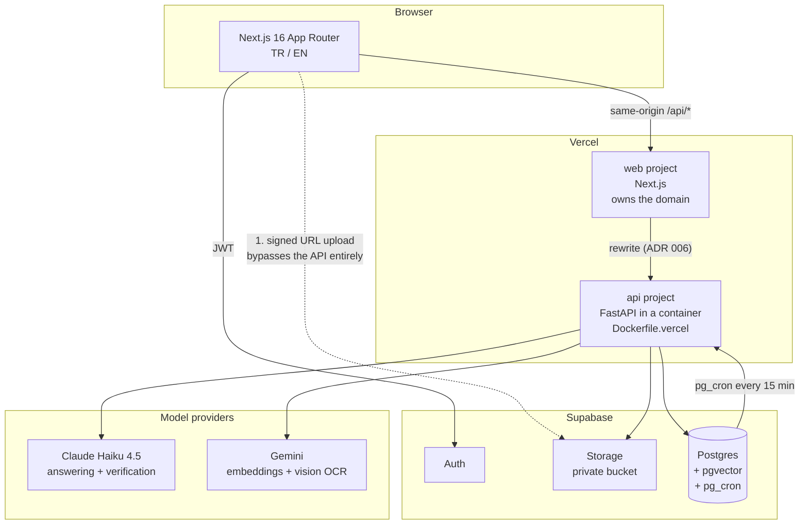
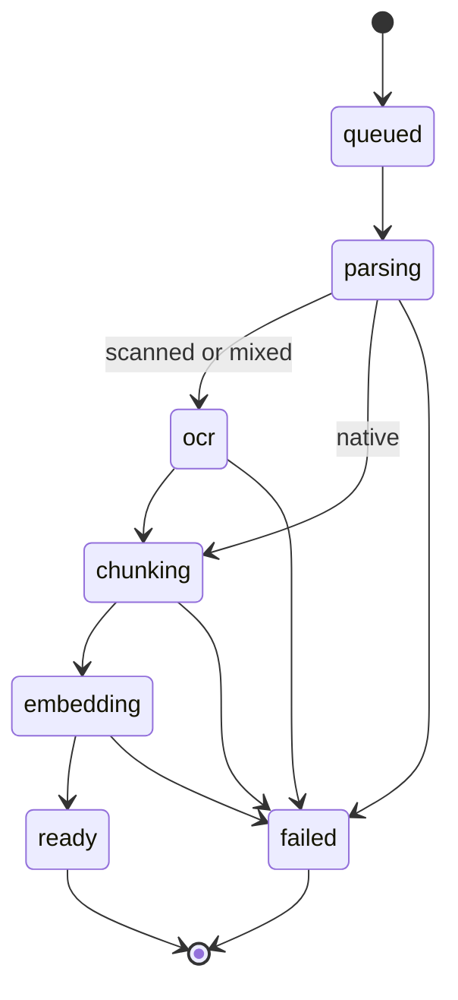
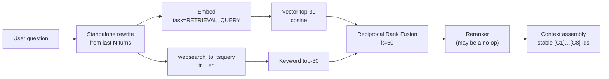
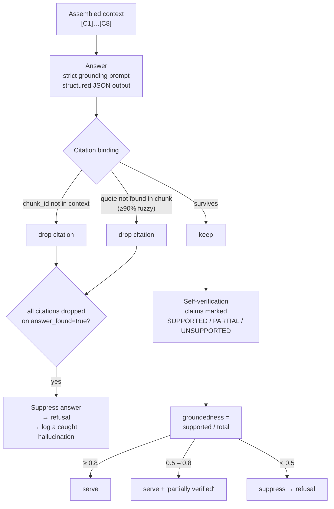

# Architecture

> Status: reflects what is built. Sections describing unbuilt phases are marked.

## System overview



The dotted line is the important one. **The PDF never transits the API.** See
constraint C1 below.

---

## The three constraints

Everything else is downstream of these.

### C1 — Request bodies are small

Serverless function request bodies are capped in the low megabytes. A 200-page
policy exceeds that. So:

1. Browser asks the API for a signed upload URL.
2. Browser `PUT`s the file **directly to Supabase Storage**.
3. Browser tells the API the resulting `storage_path`.

The API only ever handles an object reference. This is enforced in code — there
is no endpoint that accepts a file body — and the reason is commented at the
call site so nobody helpfully "simplifies" it later.

### C2 — Functions are stateless and time-bounded

Parsing, OCR and embedding a scanned document takes minutes. `POST /documents`
therefore returns `202 Accepted` immediately and the work happens out of band,
with the document's `status` column as the observable state machine:



The client polls or subscribes and renders real stage names, not a spinner.

> **Open question, Phase 1.** A scale-to-zero container can be frozen or
> reclaimed once it has written the `202`. An in-process background task is
> therefore not a safe home for a multi-minute pipeline — it will occasionally
> die silently and strand a document in `parsing` forever. The mechanism is
> decided in Phase 1 and recorded as ADR 007.

### C3 — pgvector's HNSW index stops at 2000 dimensions

`gemini-embedding-001` emits 3072 by default. Stored at full width, the column
cannot be HNSW-indexed and every query degrades to a sequential scan — a silent
performance cliff, not an error.

We request `output_dimensionality: 1536`. The model is Matryoshka-trained, so a
prefix is a designed-for truncation rather than lossy mangling. The value lives
in exactly one place, `api/constants.py::EMBEDDING_DIM`, and a unit test asserts
it stays under the ceiling.

---

## Retrieval

_Built in Phase 2._



**Why hybrid.** Policy questions mix two incompatible kinds of matching:
semantic ("does this cover flooding?") and exact ("Article 7.3",
"TL 250.000", a policy number). Pure vector search reliably misses the second.
RRF fuses the two ranked lists without needing to normalise between two
incomparable score scales — which is the whole reason it's the default choice
here rather than a weighted sum.

---

## The anti-hallucination layer

_Built in Phase 3. This is the product._



Three properties make this more than decoration:

1. **The verifier is denied the question.** It sees only the retrieved chunks and
   the drafted answer. Given the original question's framing, a verifier drifts
   toward agreeing with an answer that *sounds* responsive.
2. **Citations are checked against what was actually retrieved**, not against the
   model's claim about what it retrieved. `[C1]`-style IDs make this mechanical.
3. **Each mechanism is independently switchable** via config, which is what makes
   the ablation table in `eval/report.md` possible at all.

---

## Data model

_Built in Phase 1._ See `supabase/migrations/`.

RLS is enabled on every user table including `chunks` — a leak there leaks
document content, not just metadata.

> **RLS is defence in depth, not the control.** The API holds a service-role key
> and therefore bypasses RLS entirely. Every query in `api/retrieval/store.py`
> scopes by `user_id` in its own `WHERE` clause. Reading "RLS is enabled" as
> "we're safe" would be a mistake.

---

## Repository layout

```
web/                  Next.js frontend
api/                  FastAPI service
  ingest/             detect → parse → chunk → embed
  retrieval/          hybrid search, RRF, context assembly
  generation/         prompts, answering, verification
  safety/             quotas, circuit breaker, retention
eval/                 golden dataset + harness + generated report
supabase/migrations/  numbered SQL
docs/adr/             one file per architectural decision
```

**Interface discipline.** `DocumentParser`, `OCRProvider`, `EmbeddingProvider`,
`LLMProvider` and `Reranker` are `typing.Protocol` definitions, each with at
least one real implementation and one fake. The fakes are what make the eval
harness runnable without spending money, and what make the anti-hallucination
layers testable in isolation.
